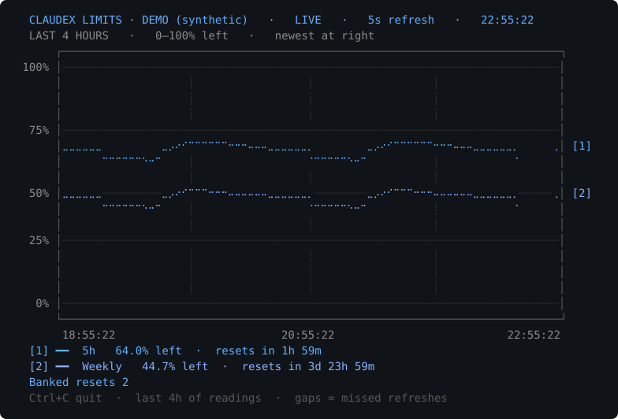

# claudex-limits

See how much Codex and Claude allowance you have left, without leaving the terminal.

`claudex-limits` prints a snapshot or a live four-hour chart of the signed-in
accounts' quota windows. Recent readings survive restarts. It detects existing
Codex and Claude Code logins automatically, without asking for tokens or starting
a model turn. When both accounts are signed in, it shows both. Codex readings
use blue shades and Claude readings use orange shades, including reset details.



Synthetic preview from `claudex-limits --demo --live`. No account data appears
in this image.

Linux and macOS are supported on amd64 and arm64. Windows is unsupported.
This is an independent project, unaffiliated with OpenAI or Anthropic.

## Quick start

Binary releases have not been published yet. [Build from source](#build-from-source)
for now. The [Releases page](https://github.com/unmanbearpig/claudex-limits/releases)
will host the archives described below.

After installation, sign in with the
[Codex CLI](https://developers.openai.com/codex/cli/) or
[Claude Code](https://code.claude.com/docs/en/authentication), then run:

```sh
claudex-limits
claudex-limits --live
```

The default discovers both providers. To select one:

```sh
claudex-limits --source codex
claudex-limits --source claude
claudex-limits --source claude --live
```

Try the chart without an account or network access:

```sh
claudex-limits --demo --live
```

Use Ctrl+C to quit. The command restores the cursor and previous terminal
screen. `claudex-limits --json` prints one machine-readable snapshot.

## Install a release

Download the matching archive and `SHA256SUMS` from
[Releases](https://github.com/unmanbearpig/claudex-limits/releases).
A downloaded binary needs no Go toolchain, Python, or proxy service.

| System | Processor | Target |
| --- | --- | --- |
| Linux | Intel or AMD 64-bit | `linux-amd64` |
| Linux | ARM 64-bit | `linux-arm64` |
| macOS | Intel | `darwin-amd64` |
| macOS | Apple silicon | `darwin-arm64` |

In the directory containing your downloads, set the version and target to
match the archive you chose. For example, a Linux amd64 release named
`claudex-limits-0.1.0-linux-amd64.tar.gz` would use:

```sh
version=0.1.0
target=linux-amd64
archive="claudex-limits-$version-$target.tar.gz"
```

Verify the selected archive on Linux:

```sh
awk -v archive="$archive" '$2 == archive { print }' SHA256SUMS | sha256sum -c -
```

Or verify it on macOS:

```sh
awk -v archive="$archive" '$2 == archive { print }' SHA256SUMS | shasum -a 256 -c -
```

Continue only if the check prints `OK`. On either system, unpack and install:

```sh
mkdir -p "claudex-limits-$version-$target"
tar -xzf "$archive" -C "claudex-limits-$version-$target"
mkdir -p "$HOME/.local/bin"
install -m 0755 "claudex-limits-$version-$target/claudex-limits" "$HOME/.local/bin/claudex-limits"
export PATH="$HOME/.local/bin:$PATH"
claudex-limits --version
```

The `export` adds the install directory to `PATH` for the current shell.
Add that line to your shell configuration to keep it for future terminals.

## Build from source

Install Go 1.26 or newer, Git, and Make. Clone the repository, or use an
existing checkout:

```sh
git clone https://github.com/unmanbearpig/claudex-limits.git
cd claudex-limits
make build VERSION=dev
mkdir -p "$HOME/.local/bin"
install -m 0755 claudex-limits "$HOME/.local/bin/claudex-limits"
export PATH="$HOME/.local/bin:$PATH"
claudex-limits --demo --live
```

The project uses only the Go standard library. Go is needed to build the
executable, not to run it. A real account read normally also needs the Codex
CLI installed and signed in. Claude usage reads can use Claude Code's saved
OAuth credentials directly.

## Flags

```text
--json                 print one JSON snapshot and exit
--live                 restore recent readings and refresh the chart until Ctrl+C
--show-nimbus-quill     include Claude's Nimbus Quill quota bucket
--interval SECONDS     live refresh interval, default 5; Claude alone defaults to 60
--source auto|codex|proxy|claude
                       choose account discovery mode, default auto detects both
--auth-file PATH       use exactly this OAuth file; add --source claude for Claude
--demo                 use synthetic data, without login or network
--version              print the build version
--help                 print flag help
```

`--interval` must be positive and finite, and only works with `--live`.
`--json` and `--live` cannot be combined. `--auth-file` cannot be combined
with `--source codex` or `--source proxy`. `--demo` cannot be combined
with an explicit account source.

## Accounts and privacy

With `--source auto`, the command discovers Codex and Claude independently.
If both logins are present, successful readings remain visible when the other
provider fails. Codex discovery uses `codex app-server` when the Codex CLI is
available. If the CLI is missing or reports no ChatGPT login, it checks the
native OAuth file and then the proxy OAuth directory. A transient failure
from an authenticated app server is reported instead of switching Codex accounts.
`--source codex` never falls back to a file or another provider.

The native file is `${CODEX_HOME}/auth.json` when `CODEX_HOME` is set, or
`~/.codex/auth.json`. The Codex CLI can also use a platform keychain, which
the app server reads for the monitor. An API key is not a ChatGPT OAuth
account; use `codex login` for the app-server source.

The proxy fallback selects the most recently modified active `codex-*.json`
under `~/.config/cliproxyapi/auth`. `--auth-file` selects exactly one file.
It accepts native nested `tokens.access_token` and `tokens.account_id`
fields, or flat proxy `access_token` and `account_id` fields.

The file-based source sends authenticated GET requests to the ChatGPT account
endpoints at `chatgpt.com/backend-api/wham/`. It reads credentials without
editing or refreshing them. The Codex CLI owns credential refresh for the
app-server source. No OAuth credentials are included in JSON output or saved
quota history. There is no project telemetry.

Claude discovery reads `${CLAUDE_CONFIG_DIR}/.credentials.json`, or
`~/.claude/.credentials.json` when `CLAUDE_CONFIG_DIR` is unset. On macOS,
the selected Claude Code Keychain item takes precedence over that file.
Keychain reads disable authentication dialogs; inaccessible credentials are
reported as unavailable. Automatic discovery uses the local `claude auth status`
command to check for a Keychain login. No login flow is opened.

If the default Claude file is absent on Linux, discovery checks the most recently
modified active `claude-*.json` in `~/.config/cliproxyapi/auth`. A custom
`CLAUDE_CONFIG_DIR` selects that configuration without falling back to a proxy
account. `--source claude --auth-file PATH` selects exactly one native or flat
proxy OAuth file and bypasses the Keychain. `--auth-file` without a Claude source
continues to select a Codex file.

Claude reads use `GET https://api.anthropic.com/api/oauth/usage` with the saved
OAuth access token and `anthropic-beta: oauth-2025-04-20`. This is an undocumented
account endpoint used by quota monitors, so Anthropic may change it. It reports
the allowance percentages and reset times available to that login. API keys and
inference-only tokens cannot provide Claude subscription quotas.

The monitor reads Claude credentials again on each fetch, so it picks up refreshes
made by Claude Code. It never refreshes or rewrites those credentials itself.
Expired tokens produce an error until Claude Code refreshes them. Claude usage
fetches run once a minute in a combined chart. Claude-only charts default to
60 seconds and accept `--interval` overrides. HTTP 429 responses pause requests
for at least a minute and respect a longer `Retry-After` value.

Never attach OAuth files, tokens, or unredacted account logs to an issue.

## Live chart and history

The chart uses colored Braille characters with two dot columns each. The newest
reading is on the right. Overlapping lines alternate colors by character;
the two dots in each character share one color. Codex lines use blue shades;
Claude lines use orange shades. The color legend sits below the chart.
Its horizontal axis always spans four hours. Missed refreshes appear as gaps;
the last successful values remain visible and are marked stale. Use a
Unicode/ANSI-capable terminal and resize it to adjust the chart.
Resizing redraws immediately without fetching another reading. The chart fills
the available height after reserving space for the legend and status messages.

Claude's Nimbus Quill bucket is hidden in text output and the live chart by
default. Use `--show-nimbus-quill` to include it. JSON snapshots and saved
history retain every reported bucket.

Every fetched snapshot is saved, including normal calls, `--json`, and live
refreshes. Starting `--live` restores the last four hours. History lives in:

- Linux: `$XDG_CACHE_HOME/claudex-limits/history`, or
  `~/.cache/claudex-limits/history` when `XDG_CACHE_HOME` is unset.
- macOS: `~/Library/Caches/claudex-limits/history`.

Recent readings in the previous `codex-limits/history` cache directory are
also loaded until they fall outside the four-hour chart. New readings are saved
under `claudex-limits/history`.
To clear all history after upgrading, delete both directories.

Each OAuth file path, Claude configuration, and Codex home has separate history.
Combined provider selections have their own history. Changing the account
within the same file or configuration keeps that source's history; delete its
history directory if you want a fresh chart.

Snapshots are appended to hourly files so concurrent calls do not overwrite
earlier readings. Old hourly files are pruned on later calls for that source.
Delete the history directory to clear saved readings. Storage failures warn
on stderr while fetched limits remain available. `--demo` neither reads nor
writes saved history.

## JSON output

`claudex-limits --json` preserves these fields:

- `five_hour_remaining_percent` and `weekly_remaining_percent` are percentages
  left. Matching `*_reset` objects contain `after_seconds`, local `at`,
  and Unix `timestamp`.
- `additional_rate_limits` contains named five-hour and weekly windows for
  other buckets.
- `windows` contains every recognized window, including 15-minute, hourly,
  and other durations. Items contain `name`, optional `remaining_percent`,
  optional `window_seconds`, and an optional `reset` object.
- `banked_resets.available` is authoritative when present. `applicable`
  appears when reported. `expirations` lists known available credit
  expirations; `expiration_details_partial` means those details are incomplete.
- `plan_type` is descriptive. It does not determine supported quota windows.
- Claude-only responses include `provider: "claude"` and use the same remaining
  percentage and window fields. Model-specific and other reported windows are
  retained, including the newer `limits` response array.
- When both providers are discovered, `provider` is `"all"`, and `accounts`
  contains each provider's `snapshot` or `error`. Combined `windows` have provider
  prefixes, such as `Claude / 5h`. Original top-level five-hour, weekly, plan,
  additional-limit, and banked-reset fields continue to refer to Codex.
- Claude's optional `extra_usage` contains `is_enabled`, reported `monthly_limit`
  and `used_credits`, and optional `remaining_percent` and `currency`. Spending
  amounts preserve the endpoint's units, generally minor currency units. A
  percentage is shown only for an enabled, positive monthly cap. No monthly
  reset time is inferred.

Unknown percentages and durations are omitted. An empty `windows` list means
no quota windows were reported, not 100% remaining or unlimited usage.

## Troubleshooting

- `no ChatGPT account is available`: run `codex login`, then retry. You can
  also pass a known OAuth file with `--auth-file PATH`.
- `ChatGPT rejected the saved OAuth token`: make a Codex request so the CLI
  can refresh its credential, then retry.
- `Claude OAuth token has expired`: reopen Claude Code to let it refresh the
  credential, then retry. Use `claude auth login` if the login was revoked.
- `Claude OAuth token lacks user:profile scope`: use a Claude Code subscription
  login. `claude setup-token` tokens provide inference access without quota access.
- `No quota windows reported`: the response was valid but contained no
  recognized quota values. Check the account and try again later.
- `claudex-limits: command not found`: check that `$HOME/.local/bin` is on
  `PATH` and that the installed executable is named `claudex-limits`.
- Redirected `--live` output uses plain-text frames. `NO_COLOR=1` disables
  color; `TERM=dumb` also disables the alternate screen.

## Development and releases

Run the checks locally:

```sh
gofmt -l *.go
make test
make vet
make race
```

Formatting is clean when `gofmt -l` prints nothing. Tests use offline fixtures
and fake app-server processes. They cover credentials, account responses,
quota normalization, chart gaps, history persistence, concurrent writes,
CLI validation, and subprocess cleanup.

Build the four Linux and macOS archives:

```sh
make release VERSION=0.1.0
```

Outputs go to `dist/0.1.0/`. Each archive contains an executable named
`claudex-limits`, this README, the quota interface notes, the preview image, and the MIT license.
`SHA256SUMS` lists exactly the four archives for that version. Builds use
`CGO_ENABLED=0` and have no native library dependency.

Releases are manual. After local checks pass, tag the reviewed commit with the
matching version, such as `v0.1.0`, and attach that version's four archives and
`SHA256SUMS` to its GitHub release. There is no CI or automatic publishing.

Runtime verification has been performed on Linux. macOS binaries are
cross-built; they have not been tested on a Mac.

Codex CLI 0.155.1 was checked for app-server startup and logged-out account
handling. A live quota read also passed through the OAuth-file fallback.
Signed-in app-server responses are covered by offline fixtures.

Claude support is covered by offline fixtures for both usage schemas, automatic
discovery, credential rotation, partial provider failures, rate-limit backoff,
history, cancellation, and orange chart rendering. An authenticated live Claude
quota read passed on Linux, returning five-hour, weekly, and additional provider
windows. macOS Keychain reads have not been tested on a Mac.

To regenerate the synthetic preview, build the binary and run
`python3 scripts/render-demo.py`. Python is only used for this documentation
utility.

## License

[MIT](LICENSE). Copyright 2026 unmanbearpig.

## Account interface references

- [Codex authentication and credential storage](https://developers.openai.com/codex/auth/)
- [Codex app-server account API](https://developers.openai.com/codex/app-server/)
- [Claude quota interface research](docs/claude-quotas.md)
